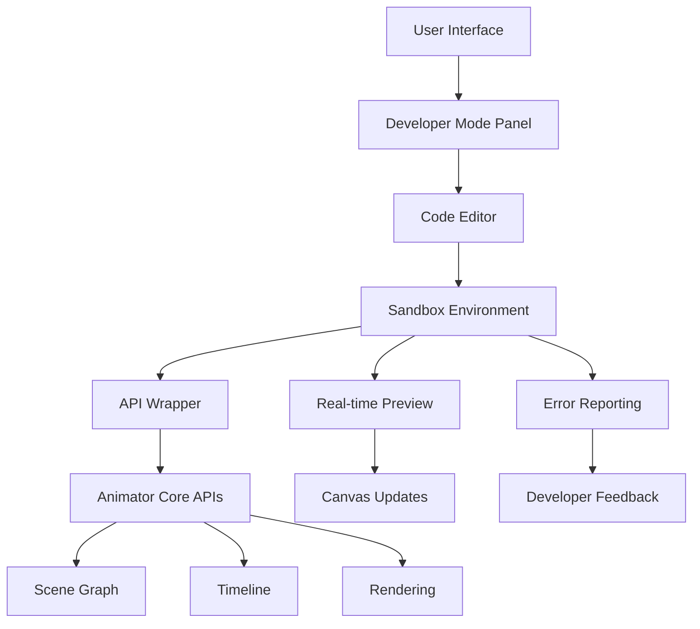

# Developer Mode Implementation Plan

## Overview

This document outlines the implementation of a built-in "Developer Mode" for Animator, inspired by Figma's Scripter plugin. Developer Mode provides users with a code editor interface that wraps the Animator API, allowing them to write JavaScript code that manipulates the scene graph, timeline, and rendering systems in real-time.

## Architecture

### Core Components

1. **Code Editor Component** - Monaco Editor integration with Animator-specific language support
2. **Sandbox Environment** - Secure execution environment for user code
3. **API Wrapper** - Safe API surface that exposes Animator functionality
4. **Real-time Preview** - Immediate visual feedback in the canvas
5. **Error Handling & Debugging** - Comprehensive error reporting and debugging tools

### System Integration



## Detailed Implementation

### Phase 1: Core Infrastructure (Week 1-2)

#### 1.1 Sandbox Environment (`src/core/sandbox/`)
- **Secure Execution Context**: Create isolated JavaScript execution environment
- **Resource Limits**: Memory (50MB default), CPU time (5s default), network restrictions
- **API Proxying**: Safe wrapper around Animator APIs with permission checking
- **Error Isolation**: Prevent user code from crashing the main application

**Key Files:**
- `src/core/sandbox/ExecutionContext.ts` - Main sandbox implementation
- `src/core/sandbox/ResourceMonitor.ts` - Memory and CPU monitoring
- `src/core/sandbox/ApiProxy.ts` - Safe API wrapper with permissions
- `src/core/sandbox/ErrorBoundary.ts` - Error isolation and reporting

#### 1.2 API Wrapper (`src/api/wrappers/`)
- **Safe API Surface**: Expose only approved Animator APIs
- **Type Safety**: Full TypeScript definitions for wrapped APIs
- **Validation**: Input validation and sanitization
- **Rate Limiting**: Prevent abuse of API calls

**Key Files:**
- `src/api/wrappers/SceneGraphWrapper.ts` - Scene graph API wrapper
- `src/api/wrappers/TimelineWrapper.ts` - Timeline API wrapper
- `src/api/wrappers/RenderingWrapper.ts` - Rendering API wrapper
- `src/api/wrappers/SafeApi.ts` - Main API wrapper coordinator

### Phase 2: User Interface (Week 3-4)

#### 2.1 Code Editor Component (`src/ui/components/CodeEditor/`)
- **Monaco Integration**: Embed Monaco Editor with custom configuration
- **Syntax Highlighting**: JavaScript/TypeScript with Animator API completions
- **Auto-completion**: Intelligent suggestions for API methods and properties
- **Error Display**: Inline error highlighting and tooltips
- **Keyboard Shortcuts**: Common development shortcuts (Ctrl+S, Ctrl+Enter, etc.)

**Key Files:**
- `src/ui/components/CodeEditor/MonacoEditor.tsx` - Monaco integration
- `src/ui/components/CodeEditor/AutoCompletion.ts` - API completion provider
- `src/ui/components/CodeEditor/ErrorDisplay.tsx` - Error visualization
- `src/ui/components/CodeEditor/SnippetManager.tsx` - Code snippet storage

#### 2.2 Developer Mode Panel (`src/ui/components/DeveloperMode/`)
- **Resizable Panel**: Dockable panel with split view (editor + preview)
- **Toolbar**: Execute, Save, Clear, Settings buttons
- **Output Panel**: Console output, errors, and execution results
- **Settings Panel**: Configure sandbox limits, API permissions, themes

**Key Files:**
- `src/ui/components/DeveloperMode/DeveloperModePanel.tsx` - Main panel
- `src/ui/components/DeveloperMode/OutputPanel.tsx` - Console and results
- `src/ui/components/DeveloperMode/SettingsPanel.tsx` - Configuration
- `src/ui/components/DeveloperMode/Toolbar.tsx` - Action buttons

### Phase 3: Real-time Integration (Week 5-6)

#### 3.1 Live Preview System (`src/ui/components/DeveloperMode/LivePreview.tsx`)
- **Immediate Updates**: Code changes reflect instantly in canvas
- **Selection Sync**: Code can select and manipulate nodes visually
- **Transform Feedback**: Visual feedback for code-generated changes
- **Performance Monitoring**: Track frame rate and memory usage

#### 3.2 State Synchronization
- **Bi-directional Updates**: Canvas changes update code variables
- **Property Watching**: Monitor property changes in real-time
- **Event Streaming**: Stream execution events to the UI

### Phase 4: Advanced Features (Week 7-8)

#### 4.1 Debugging Tools
- **Breakpoints**: Set breakpoints in user code
- **Step Execution**: Step through code execution
- **Variable Inspection**: Inspect variable values at runtime
- **Call Stack**: View execution call stack

#### 4.2 Snippet Management
- **Save/Load Snippets**: Persistent storage of code snippets
- **Tagging System**: Organize snippets by category
- **Import/Export**: Share snippets between users
- **Version Control**: Track snippet changes

#### 4.3 Performance Optimization
- **Code Caching**: Cache compiled code for faster execution
- **Lazy Loading**: Load components only when developer mode opens
- **Memory Management**: Automatic cleanup of unused sandboxes

## API Design

### Developer Mode API Surface

```typescript
// Main API available in sandbox
const api = {
  // Scene Graph
  sceneGraph: {
    createNode: (type: NodeType, parentId?: string) => SceneNode,
    getNode: (id: string) => SceneNode | null,
    setProperty: (nodeId: string, key: string, value: any) => void,
    setTransform: (nodeId: string, transform: Transform) => void,
    // ... more methods
  },

  // Timeline
  timeline: {
    createTimeline: (name: string, duration: number, fps: number) => Timeline,
    addKeyframe: (trackId: string, keyframe: Keyframe) => void,
    play: (timelineId: string) => void,
    // ... more methods
  },

  // Rendering
  rendering: {
    renderFrame: (sceneId: string, time: number) => RenderResult,
    createViewport: (container: HTMLElement) => Viewport,
    // ... more methods
  },

  // Utilities
  utils: {
    log: (...args: any[]) => void,
    generateId: () => string,
    sleep: (ms: number) => Promise<void>,
    // ... more utilities
  }
}
```

### Security Model

1. **Permission-based Access**: APIs require explicit permissions
2. **Resource Limits**: Memory, CPU, and execution time limits
3. **Network Restrictions**: No external network access by default
4. **File System Isolation**: Limited file system access
5. **API Whitelisting**: Only approved APIs are exposed

### Error Handling

```typescript
try {
  // User code execution
  const result = await sandbox.execute(code, context);
  displayResult(result);
} catch (error) {
  if (error.type === 'syntax') {
    highlightSyntaxError(error.line, error.column);
    showSuggestion(error.message);
  } else if (error.type === 'runtime') {
    highlightRuntimeError(error.stack);
    showDebugInfo(error.context);
  } else if (error.type === 'permission') {
    showPermissionError(error.resource, error.action);
  }
}
```

## Testing Strategy

### Unit Tests
- **Sandbox Security**: Verify isolation and permission enforcement
- **API Wrapping**: Test API method delegation and error handling
- **Code Editor**: Test syntax highlighting, completion, and shortcuts

### Integration Tests
- **End-to-End Workflows**: Create, edit, execute, and save code snippets
- **Real-time Updates**: Verify canvas updates reflect code changes
- **Error Scenarios**: Test various error conditions and recovery

### Performance Tests
- **Execution Benchmarks**: Measure code execution performance
- **Memory Usage**: Monitor memory consumption under load
- **Concurrent Execution**: Test multiple sandbox instances

### Security Tests
- **Sandbox Isolation**: Verify code cannot access restricted APIs
- **Resource Limits**: Ensure limits are enforced
- **Injection Prevention**: Test against malicious code patterns

## Risk Mitigation

### Security Risks
- **Sandbox Escape**: Multi-layered isolation with process boundaries
- **API Abuse**: Rate limiting and resource quotas
- **Code Injection**: Input sanitization and AST validation

### Performance Risks
- **Memory Leaks**: Automatic cleanup and garbage collection
- **CPU Spikes**: Execution time limits and monitoring
- **UI Blocking**: Asynchronous execution with progress feedback

### Usability Risks
- **Complex API**: Progressive disclosure and contextual help
- **Error Confusion**: Clear error messages with actionable suggestions
- **Learning Curve**: Interactive tutorials and example snippets

## Success Metrics

### User Experience
- **Code Execution Success Rate**: >95% of valid code executes successfully
- **Error Clarity**: <10% of users report unclear error messages
- **Feature Adoption**: >25% of advanced users use developer mode regularly

### Performance
- **Execution Time**: Average code execution <100ms
- **Memory Impact**: Developer mode adds <50MB to application memory
- **UI Responsiveness**: No perceptible impact on main application performance

### Security
- **Zero Sandbox Escapes**: No successful sandbox breaches in testing
- **Resource Compliance**: 100% of resource limits enforced
- **Permission Enforcement**: 100% of permission checks working correctly

## Rollout Strategy

### Alpha Release (Internal Testing)
- Limited to development team and select beta users
- Comprehensive logging and error reporting
- Security audits before wider release

### Beta Release (Limited External)
- Available to trusted users and partners
- Feature flags for granular control
- Monitoring for performance and security issues

### General Availability
- Full feature release with documentation
- Community tutorials and examples
- Ongoing monitoring and updates

## Future Enhancements

### Phase 5: Advanced Features (Post-Launch)
- **Plugin Development**: Tools for creating and testing plugins
- **Collaboration**: Multi-user code editing and sharing
- **Advanced Debugging**: Breakpoints, step execution, variable inspection
- **Performance Profiling**: Detailed execution analysis and optimization suggestions
- **Extension Marketplace**: Community-contributed code snippets and utilities

### Phase 6: Ecosystem Integration
- **External Editor Support**: VS Code extension for remote development
- **Version Control**: Integration with Git for code snippet management
- **Team Features**: Shared workspaces and collaborative coding
- **Enterprise Features**: Advanced security controls and audit logging

This implementation plan provides a solid foundation for building a powerful developer experience within Animator while maintaining security, performance, and usability standards.
